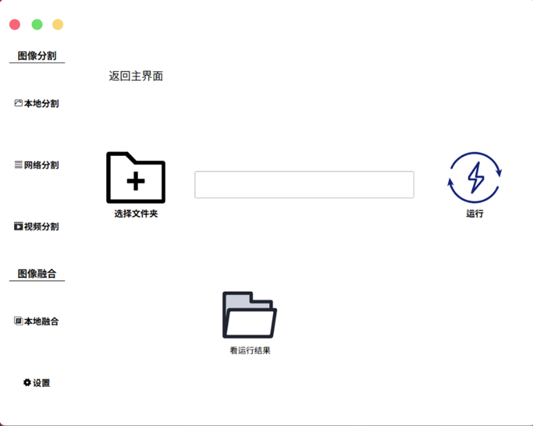
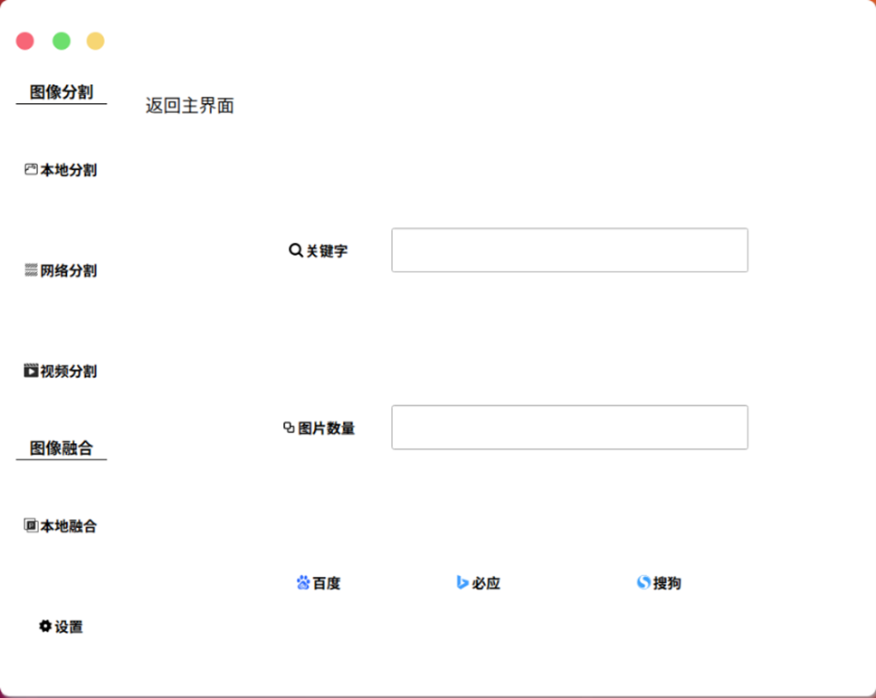
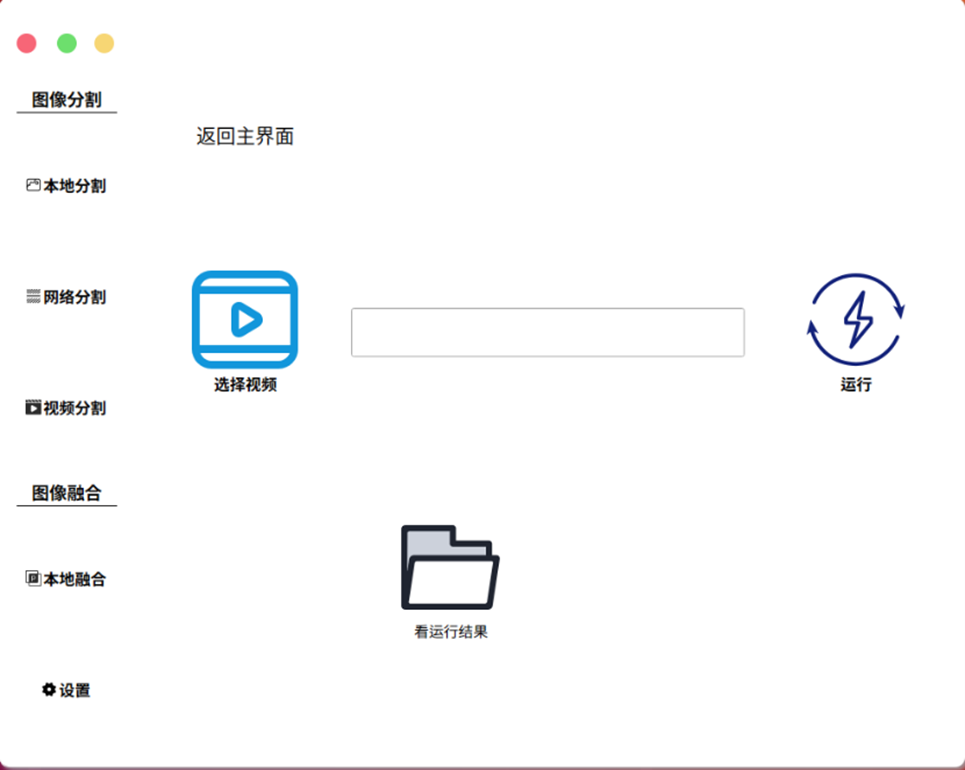
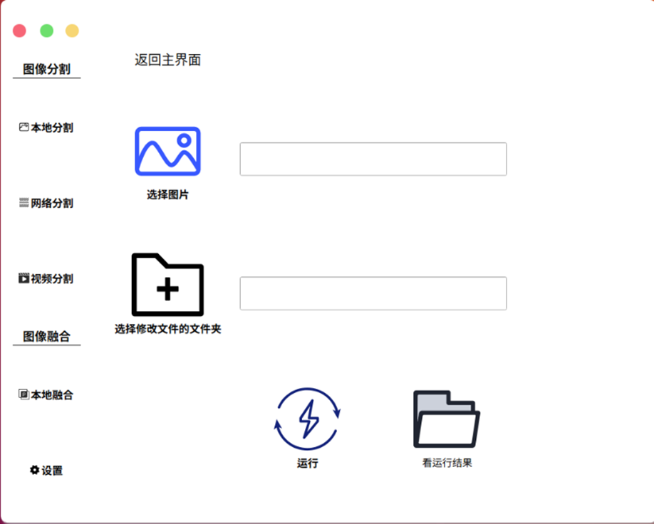
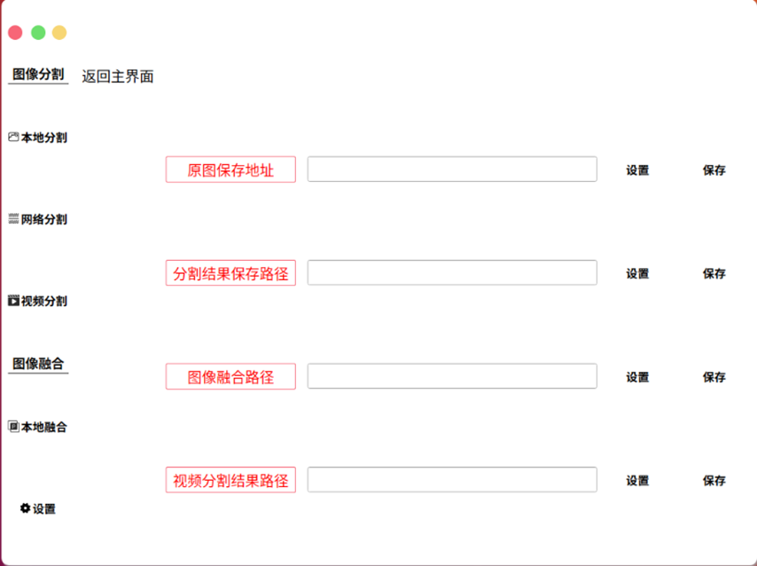
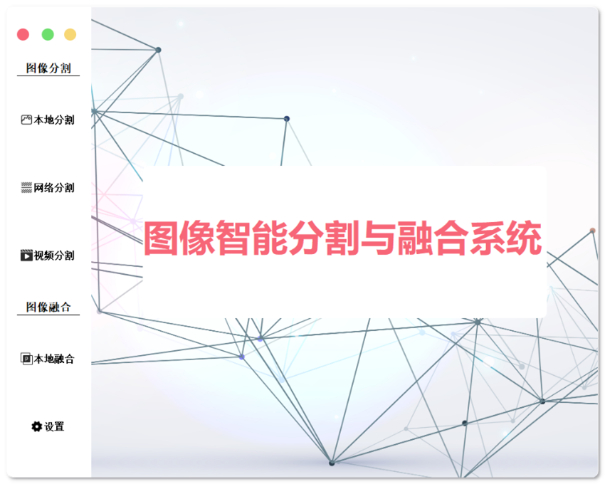

# WebSegmentSystem

> **基于显著性检测的在线图像分割融合系统**

<div align="center">
  
</div>

---

**快速导航**：[功能特性](#功能特性) | [快速开始](#快速开始) | [使用说明](#使用说明) | [项目结构](#项目结构)

---

## 📋 目录

- [项目简介](#项目简介)
- [功能特性](#功能特性)
- [技术栈](#技术栈)
- [项目结构](#项目结构)
- [环境要求](#环境要求)
- [安装说明](#安装说明)
- [使用说明](#使用说明)
- [界面展示](#界面展示)
- [注意事项](#注意事项)
- [许可证](#许可证)

## 📖 项目简介

图像智能分割与融合系统是一个基于深度学习的图像处理桌面应用程序，采用[EGNet](https://github.com/JXingZhao/EGNet)显著性检测模型实现高精度的图像分割和融合功能。该项目在2021年获得计设的国二、互联网+省二。

### 核心功能

- **🖼️ 图像分割**：使用EGNet显著性检测模型对图像进行高精度分割
- **🌐 网络图像采集**：支持从百度、必应、搜狗等搜索引擎批量下载图片
- **🎬 视频分割**：对视频文件进行逐帧分割处理
- **🎨 图像融合**：使用泊松融合算法将分割后的前景与自定义背景进行自然融合

系统采用PyQt5构建了现代化的图形用户界面，操作简单直观，适合图像处理、视频编辑、背景替换等多种应用场景。

## ✨ 功能特性

### 🖼️ 图像分割模块

#### 1. 本地分割
- 支持批量处理本地文件夹中的图片
- 自动转换为统一格式（JPG）
- 使用EGNet模型进行显著性检测和分割
- 支持查看分割结果

#### 2. 网络分割
- 支持从多个搜索引擎下载图片：
  - 百度图片
  - 必应图片
  - 搜狗图片
- 可自定义关键字和下载数量
- 自动进行图片格式验证和筛选
- 下载后自动进行分割处理

#### 3. 视频分割
- 支持常见视频格式（MP4等）
- 自动提取视频帧
- 逐帧进行分割处理
- 将分割结果重新合成为视频

### 🎨 图像融合模块

#### 本地融合
- 选择背景图片和分割结果文件夹
- 使用泊松融合（Poisson Blending）算法
- 实现自然的背景替换效果
- 支持批量处理

### ⚙️ 设置模块

- 配置原图保存路径
- 配置分割结果保存路径
- 配置图像融合路径
- 配置视频分割结果路径

## 🛠️ 技术栈

### 核心框架
- **PyQt5** - 图形用户界面框架
- **OpenCV** - 图像处理和计算机视觉库
- **PyTorch** - 深度学习框架（用于EGNet模型）

### 主要算法
- **EGNet** - 边缘引导网络，用于显著性目标检测（ICCV 2019）
- **泊松融合** - 基于泊松方程的图像无缝融合算法

### 其他依赖
- **requests** - HTTP请求库（用于网络爬虫）
- **pypinyin** - 中文拼音转换库
- **qtawesome** - Qt图标字体库

## 📁 项目结构

```
WebSegmentSystem/
├── WBNet/                          # 核心功能模块
│   ├── EGNet/                      # EGNet显著性检测模型
│   │   ├── model.py                # 模型定义
│   │   ├── run.py                  # 训练和测试脚本
│   │   ├── solver.py               # 求解器
│   │   └── epoch_resnet.pth        # 预训练模型权重
│   ├── Fuse/                       # 图像融合模块
│   │   └── Fuse.py                 # 泊松融合实现
│   ├── segmentation/               # 图像分割模块
│   │   ├── division.py             # 分割处理
│   │   └── Tojpg_save.py           # 格式转换
│   ├── spider/                     # 网络爬虫模块
│   │   ├── baidugrahp_spider.py    # 百度图片爬虫
│   │   ├── bing_spider.py          # 必应图片爬虫
│   │   └── sougou_spider.py        # 搜狗图片爬虫
│   ├── Tvideo/                     # 视频处理模块
│   │   ├── ImageTrans.py           # 视频转图像
│   │   └── VideoTrans.py           # 图像转视频
│   ├── windows/                    # GUI界面模块
│   │   ├── login.py                # 主窗口
│   │   ├── leftNavigation.py       # 左侧导航栏
│   │   ├── LocalCut.py             # 本地分割界面
│   │   ├── InternetCut.py          # 网络分割界面
│   │   ├── VideoCut.py             # 视频分割界面
│   │   ├── LocalFuse.py            # 本地融合界面
│   │   ├── set_ui.py               # 设置界面
│   │   └── img/                    # 界面图标资源
│   ├── Get_name_path/              # 路径处理工具
│   ├── setting/                    # 配置文件目录
│   ├── WBNet.py                    # 核心分割处理函数
│   ├── WBNetMain.py                # 主程序入口
│   ├── VideoMain.py                # 视频处理主函数
│   └── FuseMain.py                 # 融合处理主函数
├── original/                       # 原始图片存储目录
├── InOutput/                       # 中间处理结果目录
├── result/                         # 最终结果输出目录
├── video/                          # 视频文件目录
│   ├── input/                      # 输入视频
│   └── result/                     # 输出视频
└── BG_Transf/                      # 背景转换相关目录
    ├── backgound/                  # 背景图片
    └── result/                     # 融合结果
```

## 🔧 环境要求

### 系统要求
- Windows 10/11 或 Linux
- Python 3.7+
- CUDA支持的GPU（推荐，用于加速深度学习推理）

### Python依赖包
主要依赖包包括：
- PyQt5 >= 5.9
- opencv-python >= 4.0
- torch >= 1.0
- torchvision >= 0.2
- requests >= 2.20
- pypinyin >= 0.30
- qtawesome >= 0.6
- numpy >= 1.15
- Pillow >= 6.0

## 📦 安装说明

### 1. 克隆项目

```bash
git clone <repository-url>
cd WebSegmentSystem
```

### 2. 安装Python依赖

```bash
pip install PyQt5 opencv-python torch torchvision requests pypinyin qtawesome numpy Pillow
```

### 3. 配置模型路径

编辑 `WBNet/WBNet.py` 文件，修改以下路径为你的实际路径：

```python
# 修改模型权重路径
vgg_path = '/path/to/vgg16_20M.pth'
resnet_path = '/path/to/epoch_resnet.pth'
```

### 4. 配置数据路径

编辑 `WBNet/setting/` 目录下的配置文件，设置各种路径：
- `set_original_image_path.txt` - 原图保存路径
- `set_result_image_path.txt` - 分割结果保存路径
- `image_fuse_path.txt` - 图像融合结果路径
- `video_sagement_outcome_path.txt` - 视频分割结果路径

### 5. 下载预训练模型

从EGNet官方仓库下载预训练模型：
- ResNet版本：`epoch_resnet.pth`
- VGG版本：`vgg16_20M.pth`

将模型文件放置在 `WBNet/EGNet/` 目录下。

## 🚀 使用说明

### 启动程序

```bash
cd WBNet
python WBNetMain.py
```

### 功能使用

#### 1. 本地分割

<div align="center">
  
</div>

**操作步骤：**

1. 点击左侧导航栏的"本地分割"
2. 点击"选择文件夹"按钮，选择包含图片的文件夹
3. 点击"运行"按钮开始处理
4. 处理完成后，点击"看运行结果"查看分割结果

#### 2. 网络分割

<div align="center">
  
</div>

**操作步骤：**

1. 点击左侧导航栏的"网络分割"
2. 在"关键字"输入框中输入搜索关键词（如"风景"）
3. 在"图片数量"输入框中输入要下载的图片数量
4. 选择搜索引擎（百度/必应/搜狗）
5. 系统会自动下载图片并进行分割处理

#### 3. 视频分割

<div align="center">
  
</div>

**操作步骤：**

1. 点击左侧导航栏的"视频分割"
2. 点击"选择视频"按钮，选择要处理的视频文件
3. 点击"运行"按钮开始处理
4. 系统会提取视频帧、进行分割、然后重新合成视频
5. 点击"看运行结果"查看处理后的视频

#### 4. 本地融合

<div align="center">
  
</div>

**操作步骤：**

1. 点击左侧导航栏的"本地融合"
2. 点击"选择图片"选择背景图片
3. 点击"选择修改文件的文件夹"选择包含分割结果的文件夹
4. 点击"运行"按钮开始融合处理
5. 处理完成后查看融合结果

#### 5. 设置

<div align="center">
  
</div>

**操作步骤：**

1. 点击左侧导航栏的"设置"
2. 配置各项路径：
   - 原图保存地址
   - 分割结果保存路径
   - 图像融合路径
   - 视频分割结果路径
3. 点击"设置"按钮选择路径
4. 点击"保存"按钮保存配置

## 🖼️ 界面展示

### 主界面

系统主界面采用现代化的设计风格，左侧为功能导航栏，右侧为主要操作区域。

<div align="center">
  
</div>

### 功能模块

系统包含以下主要功能模块：

- **图像分割**：本地分割、网络分割、视频分割
- **图像融合**：本地融合
- **设置**：路径配置

## ⚠️ 注意事项

1. **模型路径配置**：首次使用前，请确保正确配置了EGNet模型的路径
2. **GPU支持**：建议使用支持CUDA的GPU以加速处理速度
3. **网络爬虫**：使用网络分割功能时，请遵守相关网站的爬虫协议
4. **文件路径**：路径中避免使用中文字符，可能导致处理失败
5. **内存占用**：处理大量图片或视频时，注意系统内存占用
6. **视频格式**：视频分割功能支持常见格式，建议使用MP4格式

## 📝 开发说明

### 核心算法

系统基于EGNet（Edge Guidance Network）进行显著性检测，该模型在ICCV 2019上发表。EGNet通过边缘引导机制，能够更准确地检测和分割显著目标。

### 图像融合

使用OpenCV的`seamlessClone`函数实现泊松融合，该算法能够实现自然的背景替换效果。

### 扩展开发

如需添加新功能，可以：
1. 在`windows/`目录下创建新的界面模块
2. 在`leftNavigation.py`中添加导航按钮
3. 在`login.py`中注册新界面

## 📄 许可证

本项目基于EGNet模型开发，EGNet模型遵循其原始许可证。

## 🙏 致谢

- [EGNet](https://github.com/JXingZhao/EGNet) - 显著性检测模型
- PyQt5社区
- OpenCV社区

## 📧 联系方式

如有问题或建议，欢迎提交Issue或Pull Request。

---

<div align="center">

**Why so serious？**

Made with ❤️ using PyQt5 and EGNet

</div>


